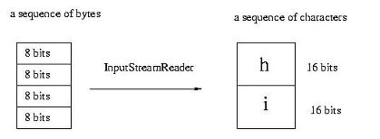
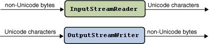

# 학습할 것 (필수)
- 스트림 (Stream) / 버퍼 (Buffer) / 채널 (Channel) 기반의 I/O
- InputStream과 OutputStream
- Byte와 Character 스트림
- 표준 스트림 (System.in, System.out, System.err)
- 파일 읽고 쓰기

# 스트림 (Stream) / 버퍼 (Buffer) / 채널 (Channel) 기반의 I/O

## 스트림(Stream)
- 흐르는 시냇물을 뜻함
- 데이터 흐름을 의미
- 순서가 있는 일련의 데이터를 의미 하는 추상적임 개념
    - 한곳에서 다른곳으로 자원을 흘러보내느 일련이ㅡ 데이터를 말함


### 입력 스트림
- 키보드, 마우스, 네트워크 등과 같은 입력장치로 부터 입력된 데이터가 순서대로 프로그램으로 흘러가는 데이터의 흐름 혹은 소프트웨어 장치

### 출력 스트림
- 프로그램에서 출력된 데이터가 프린터, 콘솔, LCD, 네트워크 등과 같은 출력 장치로 순서대로 전송되도록 보장하는 데이터의 흐름 혹은 소프트웨어 장치 

- 스트림을 통해 흘러가는 데이터의 기본단위는 바이트이다.
- 스트림은 단방향이다. 
- 스트림은 선입선출, 즉 FIFO 구조이다.
- 스트림은 서로 연결될 수 있다. 
- 스트림은 지연될 수 있다. 
    - 읽어갈 데이터가 없으면 스트림에 데이터가 도착 할때 까지 기다린다.
    - 데이터가 흐르는 통로에 데이터가 꽉 차 있다면 프로그램은 더 이상 출력할 수 없기 때문에 빈 공간이 생길때까지 기다린다.
- 스트림은 바이트 스트림과 문자 스트림으로 나눌 수 있다.
    - 문자 스트림 처리 위한 클래스 : 클래스명에 Reader, Writer가 들어가 있음
    - 바이트 스트림 처리 위한 클래스 : 들어 있지 않음

바이트 스트림 : 8비트의 바이트 단위로 데이터가 흐르는 스트림
- 모든 자바 클래스는 `InputStream`과 `OutputStream`의 서브 클래스이다.
- 데이터에 어떠한 가공을 하지 않으므로 바이너리데이터(binary data)를 입출력하는 데 적합

## 버퍼
- byte, char, int 등 기본 데이터 타입을 저장할 수 있는 저장소
- 배열과 마찬가지로 제한크기(capacity)에 순서대로 데이터 저장
- 버퍼는 데이터를 저장하기 위한것이만, 실제로 사용되는 것은 채널을 통해서 데이터를 주고 받을 때 스임
- 채널을 통해 소켓, 파일 등에 데이터를 전송할때나 읽어 올때 버퍼를 사용하게 됨으로서 가비지량을 최소화 시킬 수 있게 됨
- 이는 가비지 콜렉션 회수를 줄임으로써 서버의 전체 처리량을 증가 시킴


## 채널 
- 데이터가 통과하는 쌍방향 통로
- 채널에서 데이터를 주고 받을 때 사용되는 것 : 버퍼
- SocketChannel : 소켓관 연결된
- FileChannel : 파일과 연결된
- Pipe.SinkChannel, Pipe.SourceChannel : 파이브와 연결된
- ServerSocketChannel : 서버 소켓과 연결된

## NIO(New I/O)
- 1.4 버전 부터 추가된 API
- 넌블로킹(Non-blocking) 처리 가능
- 스트림이 아닌 채널을 사용

## IO vs NIO
### IO
각각의 스트림에서 read()와 writ()가 호출되면 데이터가 입력되고 , 데이터가 출력되기 전까지 쓰레드는 블로킹(멈춤) 상태가 됨 
- 이렇게 되면 작업이 끝날때까지 기달려야 함
- 그 이전에는 해당 IO쓰레든 사용할 수 없게되고 인터럽트도 할 수 없다.(블로킹을 빠져나오려면 스트림을 닫는 방법 밖에 없음)

### NIO
블로킹 상태에서 인터럽트를 이용하여 빠져 나올 수 있다.

|구분|IO|NIO|
|---|---|---|
|입출력방식|스트림|채널|
|버퍼방식|Non-buffer|Buffer|
|비동기방식지원|X|O|
|Blocking/Non-Blockin방식|Blocking Only| 둘다|
|사용케이스|연결클라이언트가 적고,IO가 큰경우(대용량)|연결클라이언트가 많고, IO처리가 작은 경우(저용량)|

# InputStream과 OutputStream

## InputStream
- 바이트 기반 입력 스트림의 최상위 클래스(추상클래스)
- 모든 바이트 기반 입력 스트림은 이 클래스를 상속받아서 만들어짐
- 바이트 기반 입력 스트림이 기본적으로 가져야할 메소드들이 정의 되어있음

|메소드|설명|
|---|---|
|int available()|현재 읽을 수 있는 바이트 수를 반환|
|void close()|현재 열려 있는 InputStream 을 닫음|
|void mark(int readlimit)|InputStream에서 현재의 위치를 표시|
|boolean markSupported()|해당 InputStream에서 makr()로 지정된 지점이 있는 지에 대한 여부 확인|
|abstract int read()|InputStream에서 한 바이트를 읽어서 int값으로 반환|
|int read(byte[] b)| byte[] b만큼의 데이터를 읽어서 b에 저장하고 읽은 바이트 수를 반환|
|int read(byte[] b, int off, int len)|len만큼 읽어서 byte[] b 의 off위치에 저장하고 읽은 바이트 수를 반환|
|void reset()|mark()를 마지막으로 호출한 위치로 이동|
|long skip(long n)|InputStream에서 n바이트만큼 데이터를 스킵하고 바이트 수를 반환|


## OutputStream
- 바이트 기반 출력 스트림의 최사우이 클래스로(추상클래스)
- 모든 바이트 기반 출력 스트림는 이 클래스를 상속받아서 만들어짐
|메소드|설명|
|void close()| OutputStream을 닫는다|
|void flush()| 버퍼에 남아있는 출력 스트림을 출력|
|void write(byte[] b)|버퍼의 내용을 출력|
|void write(byte[] b , int off, int lne)|b배열 안에 있는 시작 off부터 len만큼 출력|
|abstract void write(int b)|정수 b의 하위 1바이트를 출력|


# Byte와 Character 스트림
## Byte Stream
- 데이터를 Byte 단위로 주고 받는 것을 말함
- 대표적으로
    - InputStream
    - OutputStream
- 자바에서 사용하는 문자방식은 유니코드(Unicode)
    - Byte로 전송되어지는 것을 Stream에서 재해석한 후 유니코드 문자로 변환하게 됨
    - 결과적으로는 Byte를 Character로 가공하는 것
    - 문자의 인코딩은 Character Stream 에서 자동으로 해석하게 됨
- Byte Stream 들
    - PrintStream
        - OutputStream 밖에 없기 때문에 OutputStrem이란 단어 사용하지 않음
    - InputStream, OutputStream
    - ByteArrayInputStream, ByteArrayOutputStream
    - FileInputStream, FileOutputStream
    - FilterInputStream, FilterOutputStream
    - ObjectInputStream, ObjectOutputStream
    - PipedInputStream, PipedOutputStream
    - BufferedInputStream, BufferedOutputStream
    - DataInputStream, DataOutputStream


## Character Stream
- Byte들을 2Byte씩 묶어서 사용 할 수 있고, 1Byte 단위로 사용할 수 있다. 
- 그것은 문자 인코딩에 따라서 다르게 사용
- Character Stream들
    - PrintWriter
    - Reader, Writer
    - BufferedReader, BufferedWriter
    - CharArrayReader, CharArrayWriter
    - FilterReader, FilterWriter
    - InputStreamReader, OutputStreamWriter
    - FileReader, FileWriter
    - PipedReader, PipedWriter
    - StringReader, StringWriter

- Character Stream 이든 Byte Stream 이든, 둘다 모두 처음에는 Byte로 받아 들이는 것은 마찬가지
- 그리고 해당 Stream이 알아서 처리 해주는 것
- 각각의 Stream의 역할은 가공하는 방법과 장치가 다를 뿐 입출력을 도와주는 매개체로서의 역할은 동등하다. 
- 각 장치에 맞게 Stream 을 이용하는 것이 프로그래멍가 하는일 
- 결론적으로 Stream 은 원시 데이터를 프로그래머가 사용할 수 있는 데이터로 바꾸어 주는 역할



결국 인코딩은 일련의 바이트(8bit)를 유니코드 단위(2 byte 또는 16 bit)단위로 해석하는 과정을 의미



바이트 단위로 입력받아 문자 스트림으로 처리
- InputStreamReader로 부터 다른 인코딩 방식을 지정할 수 있음
    - Reader(InputStreamReader)는 한바이트 또는 한바이트 이상을 읽어 들여 유니코드로 변환하는 작업을 알아서 처리
```java
public class CharacterStreamTest {
       public static void main(String[] args) {
            try {
                     InputStream in = System.in;
                     // 입력되는 바이트를 시스템 기본인코딩에의한 문자 스트림으로 변환 한다.
                     // 기스템 기본 인코딩 방식이아닌 다른것을 지정하고 자하는 경우
                     //       InputStreamReader(in, "UTF-8") 등과 같이 인코딩 방식을 지정할 수 있다.
                     InputStreamReader charsIn = new InputStreamReader(in);

                     BufferedReader bufferedCharsIn = new BufferedReader(charsIn);
                     String line = bufferedCharsIn.readLine();
                     int i = NumberFormat.getInstance().parse(line).intValue();
                     System.out.println(i);
              } catch (IOException | ParseException e) {
                     System.out.println(e);
              }
       }
}
```

#  표준 스트림 (System.in, System.out, System.err)
- 표준 입출력 스트림의 종류는 java.lang 패키지의 System 캘르스 내부에 선언되어 있음
```java
    public class System{
        public static PrintStream out;
        public static InputStream in;
        public static PrintStream err;
        ...
    }
```

## System.in
키보드의 입력을 받아들이기 위해서 사용되는 입력 스트림
입력 스트림 사용시에는 장치 이상 등으로 인한 여러가지 예외를 발생 시킨다. 
따라서 예외처리를 해줘야함

## System.out
콘솔화면에 문자열을 출력하기 위한 용도로 사용되는 스트림

## System.out 와 System.err
둘다 PrintStream 으로 출력을 편하게 하기 위해 제공되는 출력 전용의 바이트스트림
차이점
1. err은 버퍼링을 지원 하지 않음
    - 보다 정확하고 빠르게 출력되어야 하기 때문이다.
    - 버퍼링 하던 도중 프로그램이 멈추면 버퍼링된 내용은 출력되지 않기 때문
        (자바에서는 버퍼링을 둘다 지원하지만 내부에서는 자동으로 버퍼비우기를 해버림)
2. err는 그냥 프로그램이 출력되는 콘솔창에만 출려됨

# 파일 읽고 쓰기
## 바이트 스트림 파일 읽고 쓰기 
- 바이트 스트림은 입출력되는 바이트의 바이너리 값을 있는 그대로 처리
- 따라서 스트림에 들얻오는 데이터가 문자이든 단순 바이너리 정보이든 상관없이 처리할 수 있음
- 문자는 물론 이미지나 오디오 같은 파일도 읽을 수 있다.
```java
import java.io.IOException;
import java.io.FileInputStream;
import java.io.FileOutputStream;

public class test{
    public static void main(String[] args){
        try{
            FileOutputStream out = new FileOutputStream("D:\\test.txt");
            FileInputStream in = new FileInputStream("D:\\test.txt");

            String str = "stream test";
            byte[] b = str.getBytes();// 문자를 바이트로 변환
            out.write(b); //파일 쓰기
            out.close();

            int c ; 
            while((c=in.read())!= -1){
                System.out.println((char)c);
            }
            in.close();
        }catch(Exception e){
            System.out.println(e);
        }
    }
}
```

## 문자스트림
- 오직 문자만 다룸
- 문자가 아닌 바이트 정보가 들어오면 오류로 처리
- 메모장으로 작성된 텍스트 파일아나 자바소스파일 같은 문자들로 이루어진 파일만 읽고 쓸수 있음
```java
import java.io.IOException;
import java.io.FileReader;
import java.io.FileWriter;

public class test{
    public static void main(String[] args){
        try{
            FileWriter fw = new FileWriter("D:\\test.txt");
            FileReader fr = new FileReader("D:\\text.txt");

            String str = "String stream test";
            
            fw.write(str); //파일 쓰기
            fw.close();

            int c;
            while((c = fr.read())!=-1){//while문으로 파일 읽기
                System.out.print((char)c);
            }
            fr.close();
        }catch(Exception e){
            System.out.println(e);
        }
    }
}
```

# 참조
- https://ming9mon.tistory.com/42
- 명품 자바 책
- https://m.blog.naver.com/PostView.nhn?blogId=force44&logNo=130096406237&proxyReferer=https:%2F%2Fwww.google.com%2F
- https://story.stevenlab.io/96
- https://develop-im.tistory.com/54
